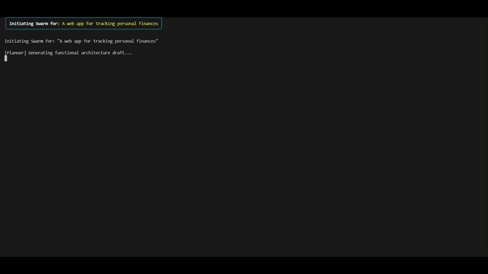

# Autonomous AI Agent Swarms for Local LLM Orchestration

 A lightweight, fully local multi-agent orchestration system that runs specialized AI agents concurrently using a single 1B-parameter LLM.

## Problem Statement
Developers lack a lightweight, privacy-preserving, and completely offline environment to execute real-time multi-agent consensus workflows without hitting hardware VRAM constraints or depending on paid cloud APIs.

## Solution

Developed a local multi-agent system engineered to execute entirely within a strict 4GB VRAM ceiling.

By optimizing a single 1B-parameter quantized model (e.g. Llama 3.2 1B) via Ollama. Instead of relying on a general-purpose agent framework it utilizes a custom, lightweight async state machine orchestrator and structured JSON outputs to force deterministic behavior from a small model in a simulated OS console stream.

### Why This Approach?

- **Local inference:** No external model API is required.
- **Privacy:** Project ideas and generated specifications remain local.
- **Low cost:** No per-token cloud inference costs.
- **Resource efficiency:** Multiple agent roles share a single small model.
- **Concurrency:** Independent critics can execute in parallel.

## 🎥 Demo



## The Architecture
A single 1B model has a tiny footprint, so instead of running one heavyweight model per role, this project runs **several specialized personas of the same model concurrently** — that's where the "swarm" actually comes from, rather than from mixing different models.

The swarm consists of five agent personas across three roles:

- **Agent A (Feature Planner):** Creative and systematic, this agent takes a raw idea and breaks it down into functional architectural components.
- **Agent B (Critic Swarm — Security / Scalability / UX):** Three independent Critic personas, each scoped to a single failure mode, run **concurrently** via `asyncio` against the same model:
  - `Critic-Security` — auth gaps, injection risk, unsafe data handling, secrets management.
  - `Critic-Scalability` — performance bottlenecks, scaling limits, resource exhaustion.
  - `Critic-UX` — confusing flows, missing edge-case handling, unclear error states.

  Their outputs are merged (union of flaws/fixes, highest severity wins) into a single criticism object before being sent back to the Planner.
- **Agent C (Summarizer):** An objective, structured compiler that combines the raw conversation between the Planner and the Critic swarm into a final, clean Markdown specification document.

### Architecture Diagram
```
                    ┌──────────────┐
                    │  User Idea   │
                    └──────┬───────┘
                           ↓
                    ┌──────────────┐
                    │    Planner   │
                    └──────┬───────┘
                           ↓
              ┌────────────┼──────────────┐
              ↓            ↓              ↓
        ┌──────────┐ ┌───────────┐  ┌──────────┐
        │ Security │ │Scalability│  │   UX     │
        │  Critic  │ │  Critic   │  │  Critic  │
        └─────┬────┘ └─────┬─────┘  └─────┬────┘
              └────────────┼──────────────┘
                           ↓
                    ┌──────────────┐
                    │   Feedback   │
                    │    Merge     │
                    └──────┬───────┘
                           ↓
                    ┌──────────────┐
                    │    Planner   │
                    │   Refinement │
                    └──────┬───────┘
                           ↓
                    ┌──────────────┐
                    │  Summarizer  │
                    └──────┬───────┘
                           ↓
                    ┌──────────────┐
                    │ Markdown Spec│
                    └──────────────┘
```

## Key Technical Features

- **Lightweight Runtime:** Built using raw Python, Pydantic for type-safe agent configuration and validation, and the official Ollama library, completely eliminating unnecessary middleware overhead.
- **Concurrent Agent Execution:** The Critic swarm runs via `asyncio.create_task` / `asyncio.as_completed` against Ollama's `AsyncClient`, so the three critic personas execute in parallel instead of blocking one another sequentially. A single critic failing doesn't abort the loop — its input is simply dropped from the merge.
```
Sequential

Security ────────┐
                 ├── Scalability ──────┐
                                      ├── UX ────► Done
                                                   ~T1+T2+T3


Concurrent

Security ────────────────┐
Scalability ─────────────┤
UX ──────────────────────┘
                          ▼
                         Done
                         ~max(T1,T2,T3)
```
> Where T1, T2, & T3 are the time taken by Security, Scalability & UX respectively
- **True JSON-Schema Enforcement:** The Planner and each Critic persona are bound to a Pydantic response model (`schemas.py`), and that model's actual JSON Schema — not just generic JSON mode — is passed to Ollama's structured outputs. Responses are then validated against the schema before being trusted, which meaningfully reduces the small-model "wandering" and hallucinated-field problem.
- **Fail-Loud Error Handling:** Any agent failure (unreachable Ollama, malformed JSON, schema mismatch) raises an explicit `AgentExecutionError` instead of silently returning `None` and letting bad data cascade into downstream prompts.
- **Custom State Machine:** The centralized `SwarmOrchestrator` dynamically routes inputs, outputs, and isolated per-agent contexts, strictly limiting loop iterations to safeguard the finite context window.
- **Context-Pruning Middleware:** A dynamic mechanism that truncates non-essential chat history to maintain real-time conversational loops without memory overflow.
- **Simulated OS Console Stream:** A real-time console TUI powered by the Python `rich` library streams each agent's output live into custom-colored containers as the swarm progresses.
- **Persistence Layer:** Automatically saves the Summarizer's final compiled technical specification as an exported `.md` file inside an organized `/workspace` directory.

## Project Sturcture
./
├── main.py
├── schemas.py
├── orchestrator.py
├── prompts.py
├── storage.py
├── requirements.txt
├── README.md
├── agents/
    └─ base_agent.py
└── workspace/
    └── generated specification files

## Installation & Setup
Before running the application, ensure all heavy background applications (web browsers, games, heavy IDE indexing) are closed to dedicate your GPU entirely to the multi-turn exchange.

**1. Install Ollama**
Download and install Ollama for your operating system.

**2. Pull the Quantized Model**
Open your terminal and pull the compact model designed for resource-constrained execution:

```bash
ollama pull llama3.2:1b
```

**3. Clone & Install Dependencies**

```bash
git clone https://github.com/Sora-developer/Autonomous_AI_Swarms_using_llama3.2.git
cd Autonomous_AI_Swarms_using_llama3.2
pip install -r requirements.txt
```

(Dependencies: `ollama>=0.2.0`, `pydantic>=2.0.0`, `rich>=13.0.0`)

## Usage
**[CHECK]** If the model being used is installed - 

```bash
ollama list
```

**[CHECK]** If ollama is not running - 

```bash
ollama serve
```

To initialize the multi-agent swarm, pass your idea to the main orchestrator script:

```bash
python main.py --idea "A web app for tracking personal finances"
```

Optional flags:

| Flag | Default | Description |
|---|---|---|
| `--idea` | *(required)* | The idea to generate a technical specification for. |
| `--max-loops` | `2` | Number of Planner ↔ Critic-swarm discussion loops before summarizing. |

**What happens under the hood:**

1. The **Planner** drafts an initial functional architecture as validated JSON.
2. The **Critic swarm** (Security, Scalability, UX) reviews that plan **concurrently**, each flagging issues in its own domain.
3. Their feedback is merged and sent back to the **Planner**, which refines the plan — this repeats for `--max-loops` rounds.
4. The **Summarizer** compiles the full discussion log into a clean Markdown specification.
5. The final specification is automatically saved locally to the `/workspace` folder.


## Limitations
- 1B model has limited reasoning capability.
- All agents share the same underlying model.
- Persona specialization doesn't create independent model intelligence.
- Local inference speed depends heavily on hardware.
- Context pruning can discard information.
- Increasing loop count increases inference cost.
- Structured outputs constrain format, not correctness.
- Critic consensus does not guarantee that criticism is correct.

> **Schema-valid ≠ factually correct.**

## Future Improvements

- Dynamic model routing
- Additional critic roles
- Persistent agent memory
- Retry and recovery policies
- Configurable agent personas